<div align="center">

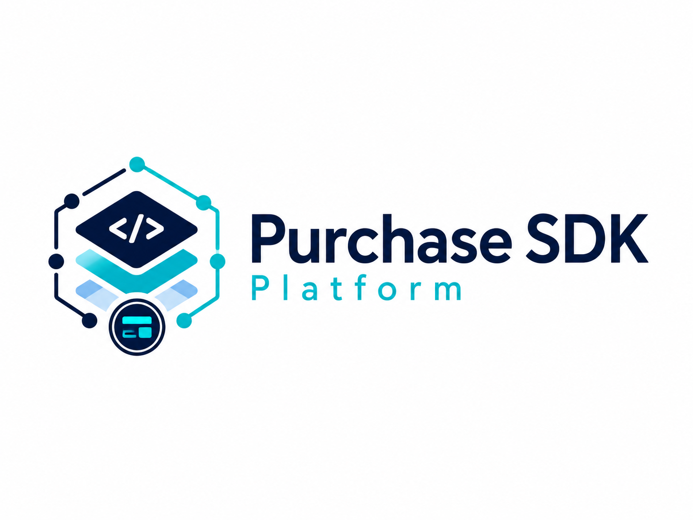

# Purchase SDK Platform

**An end-to-end in-app purchase platform — Android SDK · Spring Boot backend · React developer portal.**

Configure products and API keys in the portal, drive purchases from a drop-in Android SDK, and watch
revenue, funnels, and entitlements update live — all in a fully working **MOCK** billing mode (no real
charges), with a **Google Play** path scaffolded and failing safe until configured.


[](https://jitpack.io/#ofekgki/IAPManagement)


**Documentation site** — ([docs/index.html](https://ofekgki.github.io/IAPManagement)), served via GitHub Pages.

</div>

---

## Table of contents

- [Overview](#overview)
- [Features](#features)
- [Screenshots & video](#screenshots--video)
- [Architecture](#architecture)
- [Data model (ERD)](#data-model-erd)
- [Purchase flow (sequence)](#purchase-flow-sequence)
- [Purchase lifecycle (state)](#purchase-lifecycle-state)
- [Quick start](#quick-start)
- [SDK usage](#sdk-usage)
- [Public & internal functions](#public--internal-functions)
- [API endpoints](#api-endpoints)
- [JSON snippets](#json-snippets)
- [Database snippets](#database-snippets)
- [Documentation](#documentation)
- [Tech stack](#tech-stack)

---

## Overview

| Component | Path | Tech | Role |
|---|---|---|---|
| **Android SDK** | [`iap-sdk/`](iap-sdk) | Kotlin, Android Views, Coroutines, Gson | Drop-in client library: catalog, purchase popup, restore, entitlement checks, analytics. |
| **Demo app** | [`app/`](app) | Kotlin, Jetpack Compose, Material 3 | Reference app driving the SDK end-to-end (Store, Entitlements, Restore, Premium gate). |
| **Backend** | [`backend/`](backend) | Java 17, Spring Boot 3.3, Spring Data JPA, PostgreSQL | Source of truth: apps, keys, items, purchases, entitlements, analytics. Serves SDK + portal + internal APIs. |
| **Developer portal** | [`portal-web/`](portal-web) | React 18, TypeScript, Vite, TanStack Query, Tailwind, Recharts | Dashboard to manage apps/keys/items and view revenue & analytics. |
| **Shared** | [`shared/`](shared) | TypeScript | Cross-project enums + the response envelope contract. |

> **Run the server locally with Docker.** The backend is self-contained — from the repo root,
> `docker compose up --build` starts the backend on `http://localhost:8080` and the portal on
> `http://localhost:5173`. The Android SDK points at that local backend (`http://10.0.2.2:8080` from an
> emulator). Full steps in [Quick start](#quick-start).

> **No real payments.** MOCK mode simulates the whole flow for demo/education. GOOGLE_PLAY mode is
> scaffolded — every real step is a TODO and it fails with `GOOGLE_PLAY_NOT_CONFIGURED` rather than
> faking success. The SDK popup is a **pre-purchase** UI; Google Play's screen is never replaced.

---

## Features

**Android SDK**
- One-call init + drop-in **purchase popup** (bottom sheet) with a per-product **gradient artwork tile**.
- In-popup **payment-method picker** — Apple Pay / Google Pay / PayPal / Credit Card.
- **Restore / return** (refund) flow, all-items or **per-item**.
- **Entitlement checks** (network-first) to gate premium features.
- Automatic **analytics** events (views, popup, purchase, restore, entitlement checks).
- Self-themed UI (works even if the host app isn't a Material app); MOCK + Google Play providers.

**Backend**
- REST API for SDK, portal, and internal admin, with a uniform `{ success, data, error, requestId }` envelope.
- **Price snapshot** on every purchase → editing an item's price never rewrites historical revenue.
- **Revenue** net of restores, broken down **by payment method**, product, and a **zero-filled** time series.
- Funnel + **purchases-by-status** analytics; **paginated** purchases API.
- API keys stored **hashed**; idempotent purchase confirmation; deterministic, idempotent demo seeder.
- All queries are **derived Spring Data methods** (no hand-written SQL) — see the DB guide.

**Developer portal**
- Apps, API keys (create / revoke / rotate), items (create / edit **price** / enable-disable).
- Dashboard KPIs, **Revenue** charts, **Purchases** (with a per-purchase **event log** for debugging),
  Entitlements (manual grant/revoke), Users (add / delete), profile & password edit.
- Case-insensitive **substring search** for user/item/entitlement IDs.
- Centralized SaaS theme shared with the SDK popup and demo app.

---

## Screenshots & video

> Assets live in [`docs/media/`](docs/media) — see that folder's README for the expected file names.
> Placeholders below resolve once you add the images.

### Developer portal
| Dashboard | Revenue | Purchases |
|---|---|---|
| 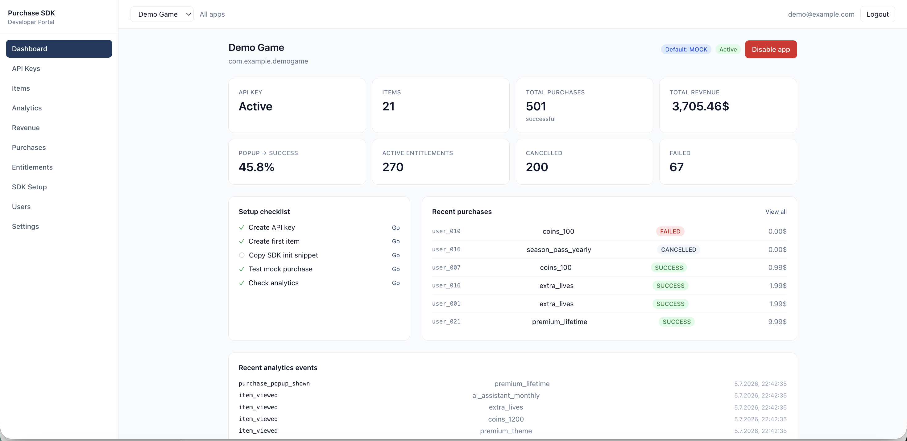 | 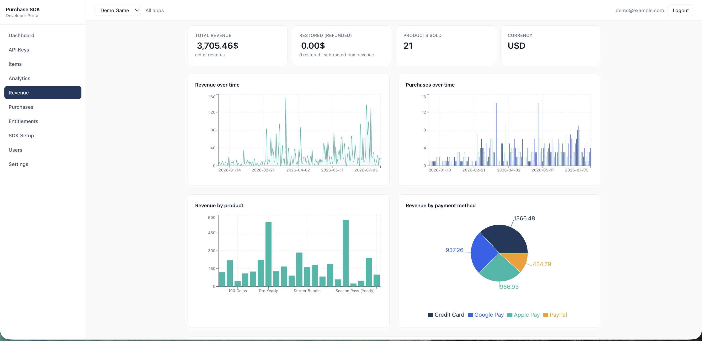 | 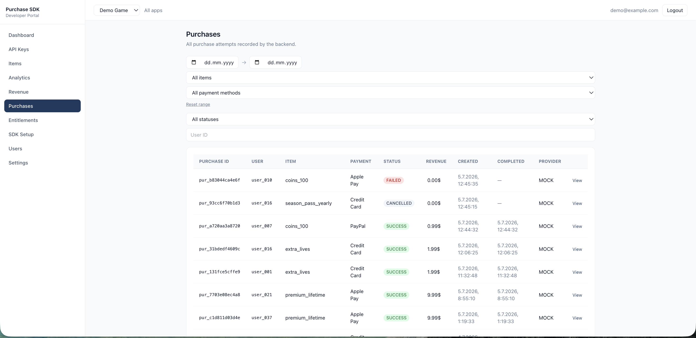 |

### Demo app (Android)
| Home | Store | Purchase popup |
|---|---|---|
| 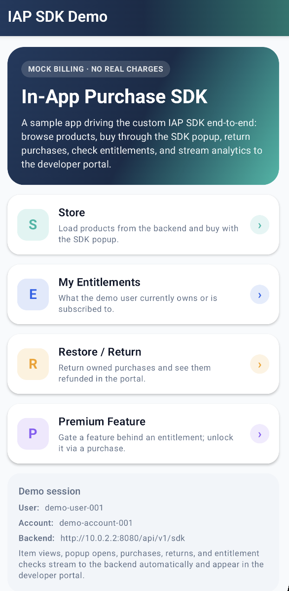 | 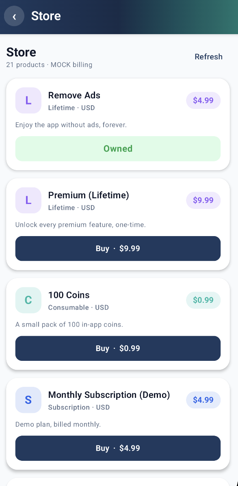 | 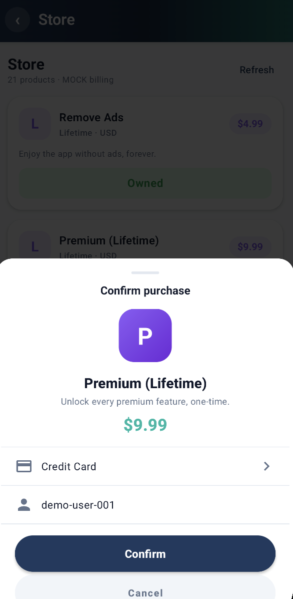 |

### Walkthrough videos
- Overview / explainer: [`docs/media/Explanation_Video.mp4`](docs/media/Explanation_Video.mp4) *(embedded on the [docs site](https://ofekgki.github.io/IAPManagement/))*
- Demo app: [`docs/media/demo-walkthrough.mp4`](docs/media/demo-walkthrough.mp4)
- Portal: [`docs/media/portal-walkthrough.mp4`](docs/media/portal-walkthrough.mp4)

---

## Architecture

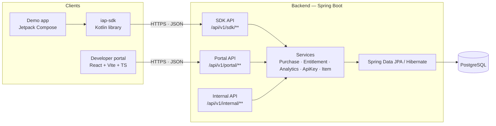

---

## Data model (ERD)

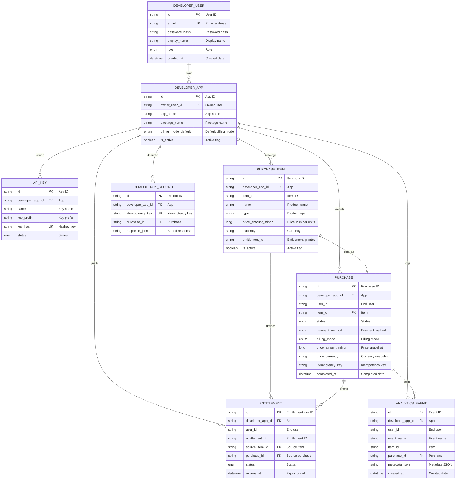

**Enum values**

| Field | Values |
|---|---|
| `developer_user.role` | `OWNER` · `ADMIN` · `VIEWER` (roles are currently un-enforced — every user has full access) |
| `*.billing_mode` | `MOCK` · `GOOGLE_PLAY` |
| `api_key.status` | `ACTIVE` · `REVOKED` |
| `purchase_item.type` | `LIFETIME` · `CONSUMABLE` · `SUBSCRIPTION` |
| `purchase.status` | `CREATED` · `PENDING` · `SUCCESS` · `FAILED` · `CANCELLED` · `REQUIRES_VERIFICATION` · `RESTORED` |
| `purchase.payment_method` | `APPLE_PAY` · `GOOGLE_PLAY` · `PAYPAL` · `CREDIT_CARD` |
| `entitlement.status` | `ACTIVE` · `EXPIRED` · `REVOKED` |

> Relationships are enforced in the service layer via app-scoped string IDs (`item_id`,
> `entitlement_id`, `purchase_id`) rather than DB foreign keys, keeping each app's data self-contained.
> Full column & index detail: [`docs/DATABASE_QUERIES.md`](docs/DATABASE_QUERIES.md).

---

## Purchase flow (sequence)

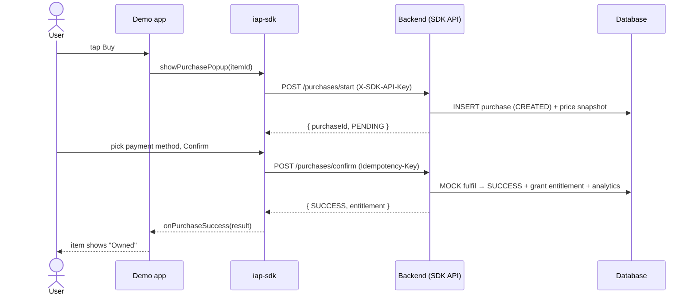

> The `Idempotency-Key` is **unique per purchase attempt**. A stable key would make the backend replay
> the first confirm and leave a re-purchase stuck at `CREATED` (never re-granting the entitlement).

---

## Purchase lifecycle (state)

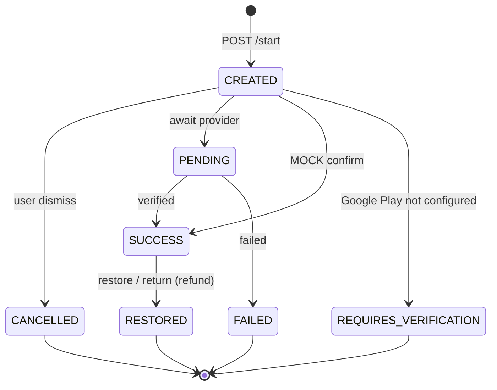

> `REQUIRES_VERIFICATION` is terminal here: Google Play verification is scaffolded and fails safe until configured.

**Terminal states:** `SUCCESS`, `FAILED`, `CANCELLED`, `REQUIRES_VERIFICATION`, `RESTORED`.

---

## Quick start

### 1. Backend + portal + database (Docker Compose)

The stack runs on **PostgreSQL via Docker** — one command brings up the database, backend, and portal:

```bash
cp .env.example .env            # optional for local
docker compose up --build
# Postgres: internal to the compose network
# Backend:  http://localhost:8080   (health: /api/v1/health)
# Portal:   http://localhost:5173   (login: demo@example.com / password123)
```

### 2. Demo app (Android)

```bash
# Open the repo in Android Studio and run the `app` module on an emulator.
# It targets http://10.0.2.2:8080 (emulator -> host, i.e. the Dockerized backend).
# For a physical device, set DemoConfig.BACKEND_SDK_BASE_URL to your LAN IP.
```

**Seeded demo:** user `demo@example.com` / `password123`, app `app_demo`, API key `demo_api_key_123`,
~21 items and a realistic purchase/analytics history from **2026-01-01 -> today**. Reset any time via
Portal -> **Settings -> Danger zone**.

---

## SDK usage

### Install (JitPack)

**1. Add the JitPack repository** to `settings.gradle.kts` (or your root `build.gradle`):

```kotlin
// settings.gradle.kts
dependencyResolutionManagement {
		repositoriesMode.set(RepositoriesMode.FAIL_ON_PROJECT_REPOS)
		repositories {
			mavenCentral()
			maven { url 'https://jitpack.io' }
		}
	}
```

**2. Add the dependency** in your app module, using a released tag (or `main-SNAPSHOT` for the latest commit):

```kotlin
// app/build.gradle.kts
	dependencies {
	        implementation 'com.github.ofekgki:IAPManagement:1.0.2'
	}
```

**Requirements:** `minSdk 24`. No Material Components theme required in the host app — the popup themes itself.

### Use it

```kotlin
// 1) Initialize once (e.g. Application.onCreate)
PurchaseSdk.init(
    context = applicationContext,
    apiKey = "demo_api_key_123",
    billingMode = BillingMode.MOCK,
    userId = "demo-user-001",
    config = PurchaseSdkConfig(baseUrl = "http://10.0.2.2:8080/api/v1/sdk"),
)

// 2) Load the catalog (suspend)
val items: List<PurchaseItem> = PurchaseSdk.getItems()

// 3) Show the drop-in purchase popup
PurchaseSdk.showPurchasePopup(
    activity = this,
    itemId = "remove_ads",
    listener = object : PurchaseListener {
        override fun onPurchaseSuccess(result: PurchaseResult) { /* unlock */ }
        override fun onPurchaseCancelled() { }
        override fun onPurchaseFailed(error: PurchaseSdkError) { }
    },
)

// 4) Gate a premium feature
if (PurchaseSdk.hasEntitlement("remove_ads")) { showPremiumUi() }

// 5) Restore / return (all or one item)
val restored = PurchaseSdk.restorePurchases(itemId = "remove_ads")
```

---

## Public & internal functions

### Public API — `PurchaseSdk` (object)
| Function | Description |
|---|---|
| `init(context, apiKey, billingMode, userId?, config?)` | Initialize the SDK (once). |
| `isInitialized(): Boolean` | Whether `init` has run. |
| `suspend getItems(): List<PurchaseItem>` | Load the active catalog from the backend. |
| `suspend getItem(itemId): PurchaseItem` | Fetch a single product. |
| `showPurchasePopup(activity, itemId, listener)` | Present the drop-in purchase sheet. |
| `suspend makePurchase(itemId, paymentMethodId?): PurchaseResult` | Headless purchase (build your own UI). |
| `suspend restorePurchases(itemId?): List<PurchaseResult>` | Restore/return all owned items, or one. |
| `suspend hasEntitlement(itemId): Boolean` | Network-first entitlement check. |
| `suspend listEntitlements(): List<UserEntitlement>` | The user's entitlements. |
| `trackEvent(eventName, properties)` | Emit a custom analytics event. |
| `logout()` | Clear cached user/entitlement state. |

### Internal building blocks (`internal` — not part of the public API)
| Class | Key functions |
|---|---|
| `PurchaseManager` | `loadItem`, `loadItems`, `makePurchase`, `restorePurchases`, `handlePurchaseFailure` |
| `BillingProvider` (interface) | `getItem`, `getItems`, `makePurchase(itemId, userId, paymentMethod?)`, `restorePurchases(userId, itemId?)` — impls: `MockBillingProvider`, `GooglePlayBillingProvider` |
| `ApiClient` | `fetchItems`, `fetchItem`, `createPurchase`, `confirmPurchase`, `cancelPurchase`, `restorePurchases`, `fetchEntitlements`, `sendAnalyticsEvent` |
| `EntitlementManager` | `hasEntitlement`, `listEntitlements`, `refreshEntitlements`, `cacheEntitlements`, `addOrUpdateEntitlement`, `clearEntitlements` |
| `PurchasePopupController` | `showPopup`, `dismissPopup`, `isPopupShowing` |
| `PurchasePopupView` | `bind`, `bindItem`, `setLoadingState`, `showError` + generated per-product artwork |
| `AnalyticsTracker` | `trackPopupShown`, `trackPurchaseStarted/Success/Failed`, `trackRestoreStarted/Success/Failed`, `trackHasEntitlementChecked`, ... |

---

## API endpoints

Full reference with request/response shapes: **[`docs/API_ENDPOINTS.md`](docs/API_ENDPOINTS.md)**.

**SDK** (`X-SDK-API-Key`)
```
POST /api/v1/sdk/init
GET  /api/v1/sdk/items · /items/{itemId}
POST /api/v1/sdk/purchases/start · /confirm (Idempotency-Key) · /restore
GET  /api/v1/sdk/entitlements · /entitlements/check
POST /api/v1/sdk/analytics/events
```

**Portal** (`Authorization: Bearer <JWT>`)
```
POST /api/v1/portal/auth/register · /login · /logout   ·   GET/PATCH /auth/me
GET/POST /api/v1/portal/users   ·   DELETE /users/{id}
GET/POST /api/v1/portal/apps   ·   GET/PATCH/DELETE /apps/{appId}
GET/POST .../apps/{appId}/api-keys   ·   POST .../{keyId}/revoke · /rotate
GET/POST .../apps/{appId}/items   ·   GET/PATCH .../{itemId}   ·   POST .../{itemId}/enable · /disable
GET .../apps/{appId}/purchases (paginated)   ·   GET .../purchases/{purchaseId}
GET .../apps/{appId}/entitlements   ·   POST .../entitlements/grant · /revoke
GET .../apps/{appId}/analytics/overview · /funnel · /revenue · /revenue/by-product · /revenue/by-time · /purchases-by-status · /events
POST /api/v1/portal/maintenance/reset-demo-data?reseed=true|false
```

**Internal** (`X-Internal-Admin-Token`)
```
POST /api/v1/internal/items · PATCH /items/{itemId}
GET  /api/v1/internal/purchases · /analytics/summary
POST /api/v1/internal/entitlements/grant · /revoke
```

---

## JSON snippets

**Response envelope** (every endpoint)
```json
{ "success": true, "data": { }, "error": null, "requestId": "req_8f3c" }
```

**Start a purchase** — `POST /api/v1/sdk/purchases/start`
```json
{ "userId": "demo-user-001", "itemId": "remove_ads", "billingMode": "MOCK", "paymentMethod": "GOOGLE_PLAY" }
```

**Revenue summary** — `GET /api/v1/portal/apps/{appId}/analytics/revenue`
```json
{
  "totalRevenueMinor": 422639,
  "currency": "USD",
  "byPaymentMethod": [
    { "paymentMethod": "CREDIT_CARD", "revenueMinor": 139050, "purchases": 214 },
    { "paymentMethod": "GOOGLE_PLAY",  "revenueMinor": 93726,  "purchases": 141 }
  ],
  "overTime": [ { "bucket": "2026-06-30", "revenueMinor": 0, "purchases": 0 } ],
  "restoredValueMinor": 999,
  "restoredCount": 1
}
```

**Error**
```json
{ "success": false, "data": null,
  "error": { "code": "GOOGLE_PLAY_NOT_CONFIGURED", "message": "Google Play Billing is not configured." },
  "requestId": "req_2f7a" }
```

---

## Database snippets

All persistence is **Spring Data JPA** — derived query methods, no hand-written SQL. Examples of the
SQL Hibernate generates (see [`docs/DATABASE_QUERIES.md`](docs/DATABASE_QUERIES.md) for every method):

```sql
-- Revenue window (served by idx_purchase_app_status_completed)
SELECT * FROM purchase
WHERE developerAppId = ? AND status = 'SUCCESS'
  AND completedAt >= ? AND completedAt < ?;

-- Paginated portal listing (served by idx_purchase_app_created)
SELECT * FROM purchase
WHERE developerAppId = ? AND createdAt >= ? AND createdAt < ?
ORDER BY createdAt DESC;

-- Index-only event count for the funnel (idx_evt_app_name_time)
SELECT COUNT(*) FROM analytics_event
WHERE developerAppId = ? AND eventName = ? AND createdAt BETWEEN ? AND ?;
```

Key columns worth knowing (`purchase` table):

| Column | Notes |
|---|---|
| `priceAmountMinor`, `priceCurrency` | **Price snapshot** at purchase time -> historical revenue is immune to later price edits. |
| `paymentMethod` | `APPLE_PAY` / `GOOGLE_PLAY` / `PAYPAL` / `CREDIT_CARD` — the revenue breakdown dimension. |
| `status` | `CREATED · PENDING · SUCCESS · FAILED · CANCELLED · REQUIRES_VERIFICATION · RESTORED`. |
| `idempotencyKey` | Unique per attempt; dedupes confirm retries on `(developerAppId, idempotencyKey)`. |

---

## Documentation

| Doc | What's inside |
|---|---|
| [Docs site](https://ofekgki.github.io/IAPManagement/) ([`docs/index.html`](docs/index.html)) | Firebase-style docs home — overview video, use cases, get-started. |
| [Integration guide](https://ofekgki.github.io/IAPManagement/integration.html) ([`docs/integration.html`](docs/integration.html)) | Step-by-step: add the SDK, initialize, purchase, entitlements, restore, analytics. |
| [`docs/API_ENDPOINTS.md`](docs/API_ENDPOINTS.md) | Every REST endpoint with auth, request & response shapes. |
| [`docs/DATABASE_QUERIES.md`](docs/DATABASE_QUERIES.md) | Every repository method, generated SQL, tables & index design. |
| [`docs/DEMO_GUIDE.md`](docs/DEMO_GUIDE.md) | Run-the-demo walkthrough and click-by-click script. |
| [`docs/DEVELOPER_GUIDE.md`](docs/DEVELOPER_GUIDE.md) | Deeper developer/integration notes. |
| [`docs/media/`](docs/media) | Screenshots & videos referenced by this README. |

---

## Tech stack

| Layer | Technologies |
|---|---|
| **Android SDK** | Kotlin · Android View system · Kotlin Coroutines · Material Components · Gson · `HttpURLConnection` · ContentProvider auto-init |
| **Demo app** | Kotlin · Jetpack Compose · Material 3 |
| **Backend** | Java 17 · Spring Boot 3.3 · Spring Web · Spring Data JPA / Hibernate · Spring Security (JWT) · PostgreSQL (via Docker) |
| **Developer portal** | React 18 · TypeScript · Vite · React Router · TanStack Query · Axios · Tailwind CSS · Recharts |
| **Shared** | TypeScript (cross-project enums + response envelope) |
| **Build & tooling** | Gradle (AGP 9, built-in Kotlin) · Maven · JitPack · Docker Compose |
| **Docs** | GitHub Pages · Mermaid diagrams |

---

<div align="center">

**Educational project — no real payment processing.** MOCK mode is for demo/testing/learning only;
GOOGLE_PLAY mode requires real server-side verification before it may grant entitlements.

</div>
